# Проект по тестированию личного кабинета сети медицинских клиник

**Медицинские центры К+31** ️— частные многопрофильные семейные клиники в Москве.

**Страница** [личного кабинета](https://lk.k31.ru/)

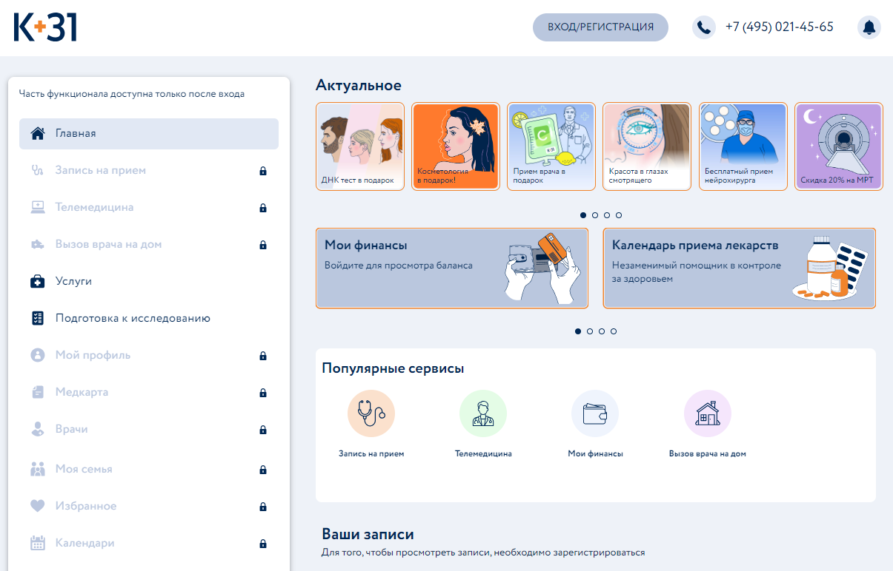

<!-- Список проверок-->
## Список проверок, реализованных в автотестах:

### UI автотесты:

✔️ Открытие главной страницы личного кабинета без авторизации   
✔️ Проверка успешной авторизации  
✔️ Ошибка авторизации при неправильно введённом пароле   
✔️ Выход из личного кабинета  
✔️ Успешный поиск по комплексным программам и обследованиям  
✔️ Неуспешный поиск по комплексным программам и обследованиям    
✔️ Проверка отображения в профиле телефона, введённого при авторизации  

### API автотесты (везде была проверка ответа и его схемы):  

✔️ Успешная авторизация  
✔️ Неуспешная авторизации  
✔️ Добавление автомобиля в профиль  
✔️ Удаление автомобиля из профиля  
✔️ Запрос владения автомобилями у другого пользователя  


### MOBILE автотесты:  

✔️ Успешная авторизация  
✔️ Неуспешная авторизации  
✔️ Поиск по комплексным программам и обследованиям  


## Проект реализован с использованием:

<p  align="center">
<code></code>
<code></code>
<code></code>
<code></code>
<code></code>
<code></code>
<code></code>
<code>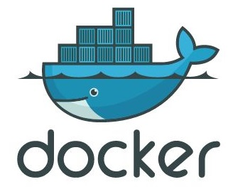</code>
<code></code>
<code></code>
<code>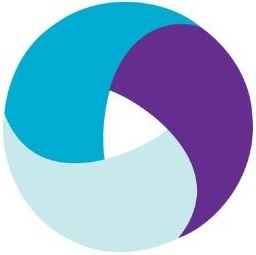</code>
<code></code>
<code></code> 
<code></code>
<code></code>
<code></code>   


## Особенности проекта
- Автотесты на WEB UI, API и Android App
  - Автотесты WEB UI запускаются через Selenoid
  - Автотесты Android App через BrowserStack или с помощью локального эмулятора
- Сборка проекта в Jenkins
- Интеграция с Allure TestOps
- Отчёты Allure Report
- Автоматизация отчётности о тестовых прогонах и тест-кейсах в Jira
- Отчеты с видео, скриншотами, логами
- Оповещения о тестовых прогонах в Telegram


## Локальный запуск  

Для локального запуска выполнить команду в терминале:

Все тесты:<br>
```bash
    CONTEXT=local_emulator pytest tests --browser_version=100.0
```

UI тесты:<br>

```bash
    pytest tests/web --browser_version=100.0
```

API тесты:<br>
```bash
    pytest tests/api
```
   
mobile тесты на эмуляторе:<br>
```bash
    CONTEXT=local_emulator pytest tests/mobile
```
   
mobile тесты на bstack:<br>
```
    CONTEXT=bstack pytest tests/mobile
```
   
**Параметры:**

- ️`--browser_version` — оставить пустым, чтобы был скачан актуальный вебдрайвер

**Переменные окружения**

- `CONTEXT` — Задаёт контекст выполнения теста: 
  - `local_emulator` — для локального запуска на эмуляторе Android.
  - ️`local_real` — для локального запуска на устройстве. 
  - ️`bstack` — для запуска в облаке BrowserStack. 

## Удалённый запуск 

Выполняется на сервере Jenkins

### 1. Открыть <a target="_blank" href="https://jenkins.autotests.cloud/job/k31_test_project/">проект</a>


### 2. Выбрать пункт **Собрать с параметрами**/**Build with Parameters**
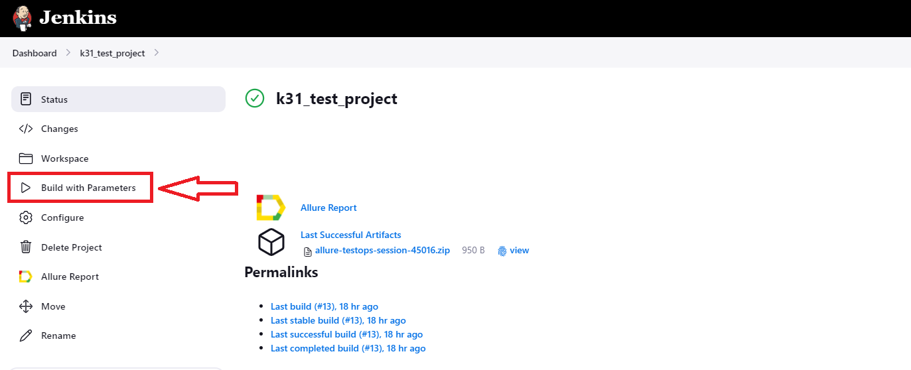

### 3. Внести изменения в конфигурации сборки, при необходимости
- ️`BROWSER_VERSION` - выбор версии браузера для запуска тестов, по умолчанию 100.0, вручную можно внести другое значение (99.0, 120.0 или др.)
- `ENVIRONMENT` - значение окружения, можно выбрать из выпадающего списка
- `COMMENT` - комментарий, который будет отправлен в сообщении от бота в Телеграм

### 4. Нажать **Собрать**/ **Build**
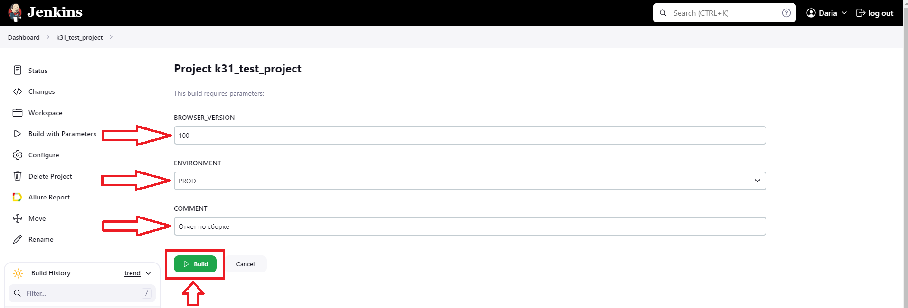

### 5. Результат запуска сборки можно посмотреть в отчёте Allure
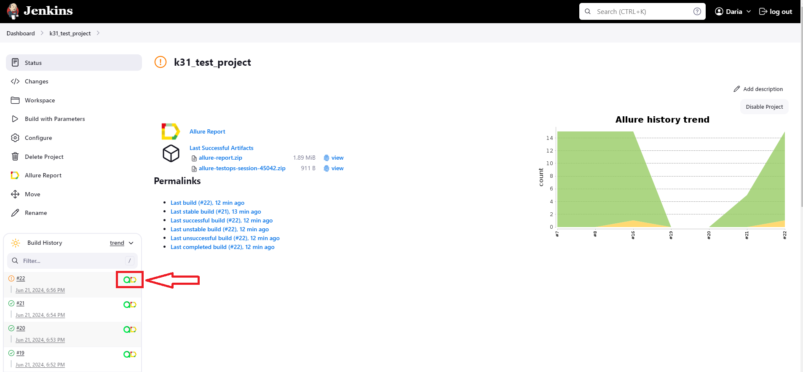


## Запрос на формирование отчёта:

️команда для Windows

```bash
allure serve
```
️команда для MacOS

```bash
allure serve allure-results
```


### Allure отчёт

#### Общие результаты в Allure Report и Allure TestOps
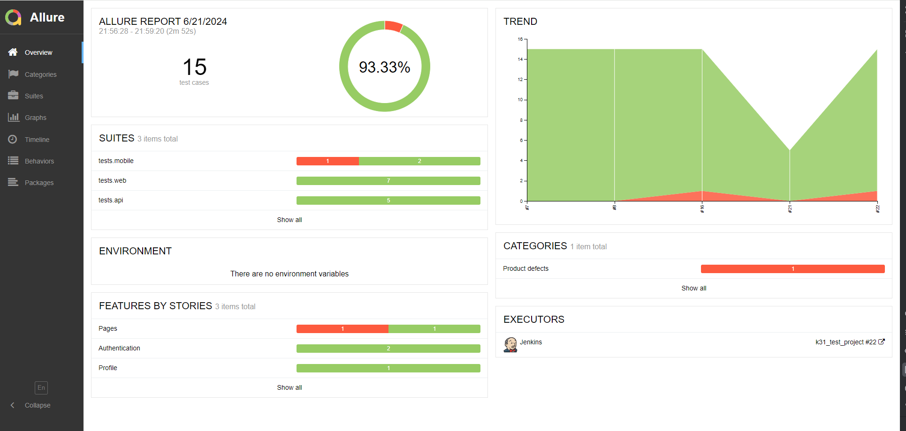
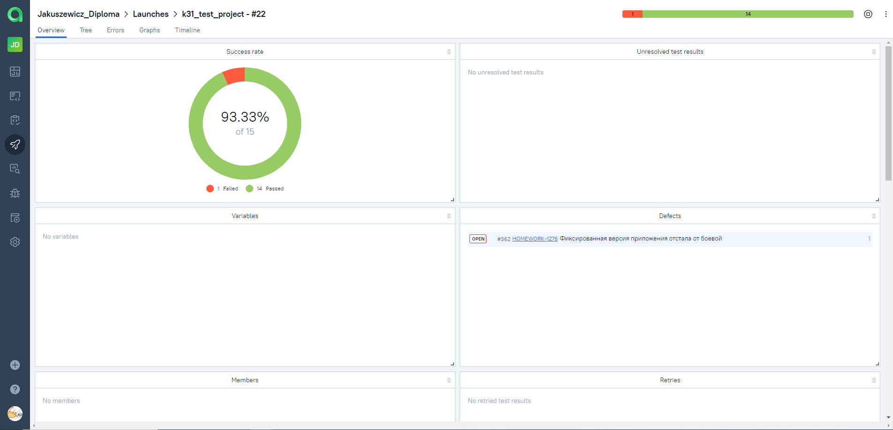

#### Пример тест-кейса в Allure Report с логированием и attachments
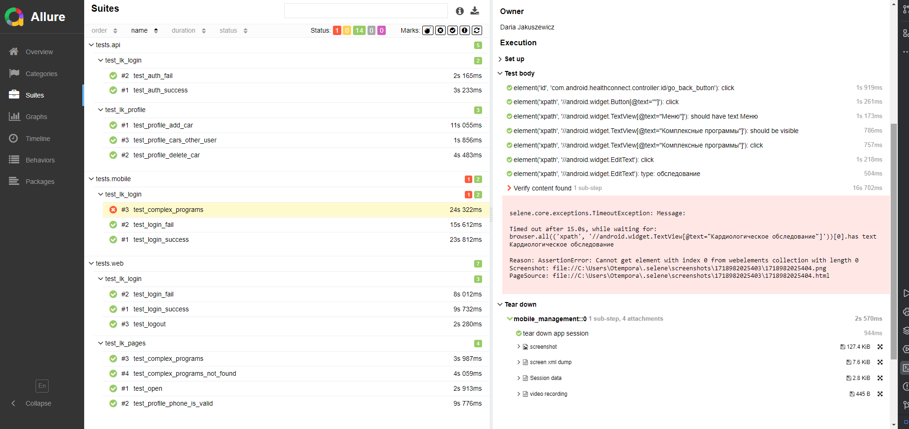

#### Пример тест-кейса в Allure TestOps с логированием и attachments
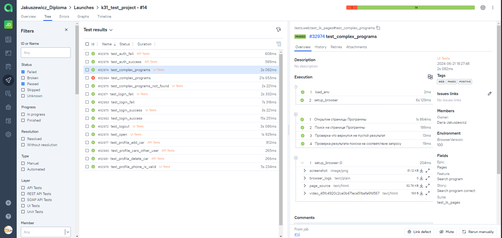

#### Интеграция с Jira
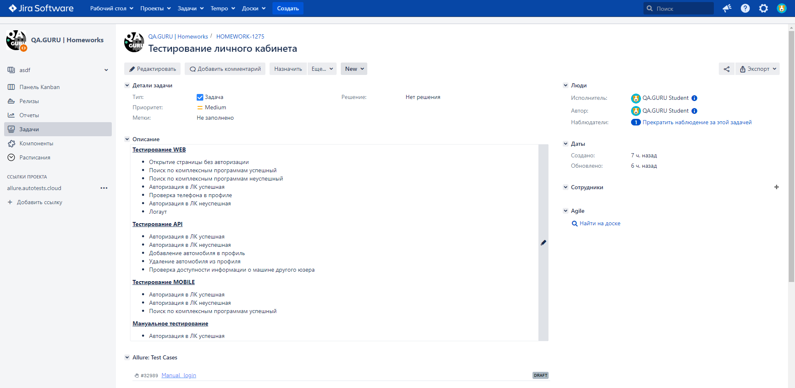

#### Заведение дефекта (интеграция с Jira)
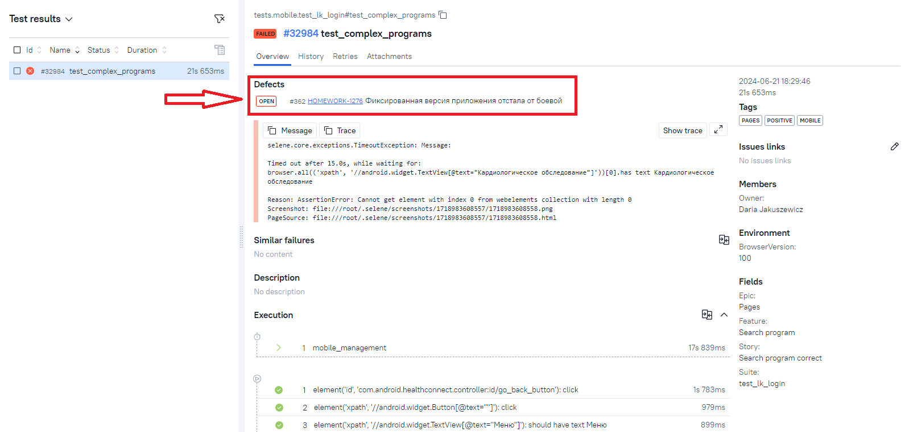

## Видео прохождения теста:
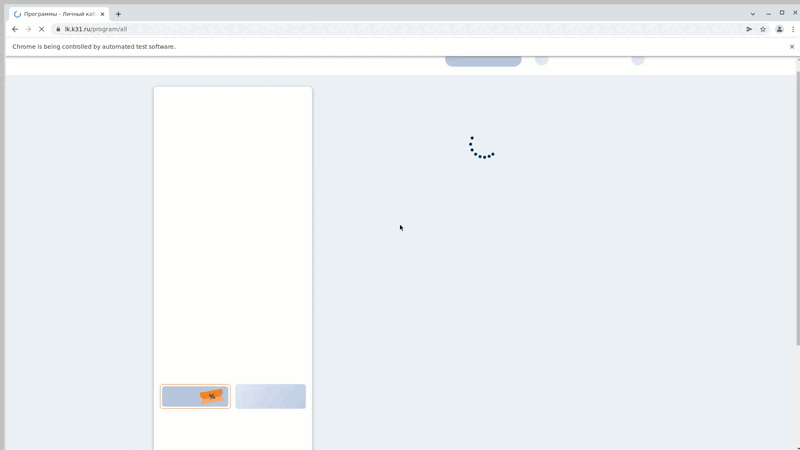

## Получение уведомлений о прохождении тестов в Telegram
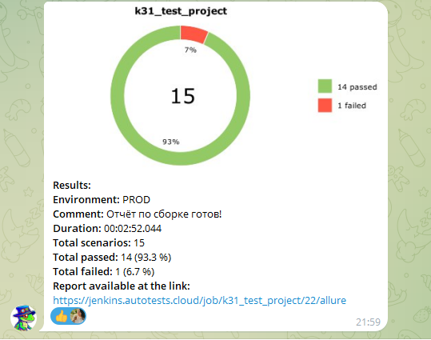
